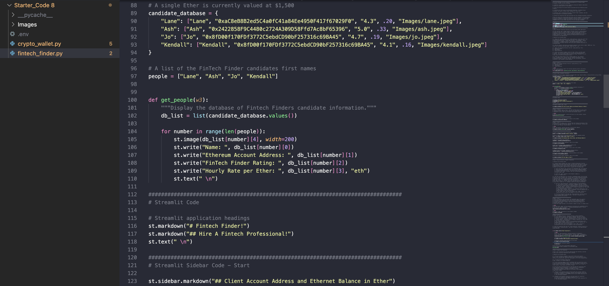
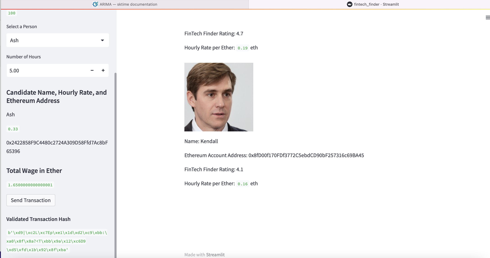
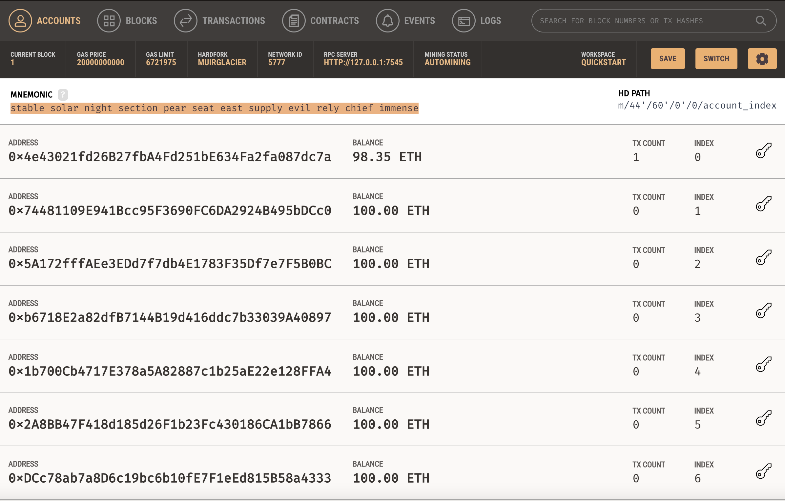
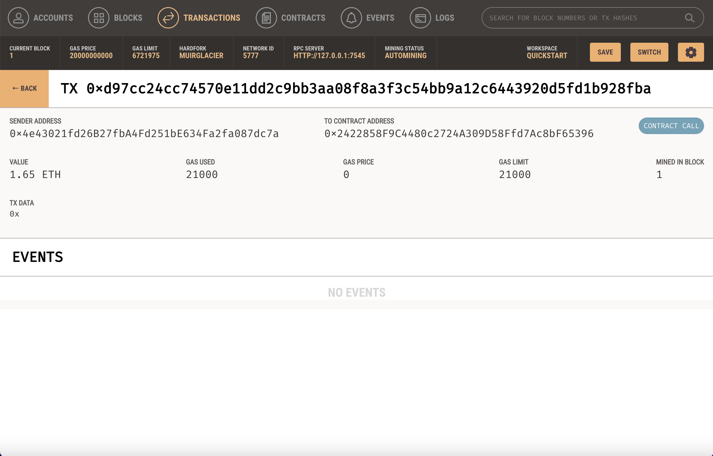

# *Ethereum Blockchain - Application for Hiring Fintech Professionals*
---

**Welcome to my repository for the App for Hiring Fintech Professionals. Please explore the codebase!**  

---
## Analytical Summary

This project integrates an Ethereum blockchain into a web app. This application enables customers to send cryptocurrency payments to fintech professionals.

---

## Usage

To use this project simply clone the repository and run the code **streamlit run fintech_finder.py** in your terminal.

!Before running the code, you need to populate your .env file with a mnemonic phrase, if using Ganache, insert the phrase visible as the first line in the Ganache app.

---

## Methodology
This project allows you to integrate Blockchain network into a web application. With this web app you can send money to Fintech professionals. The process is tested with Ganache 2.5.4.

The snippet of the code is here:

The streamlit web app displays fintech professionals on the right side and transaction details on the left side:

If the transaction is valid, validated transaction hash appears in the left corner.

You can confirm the transaction in your Ganache program where you can see your account balance (the first line) is smaller for the transaction amount.

The transaction details in the Ganache are following:

---

## License

MIT

---

 
